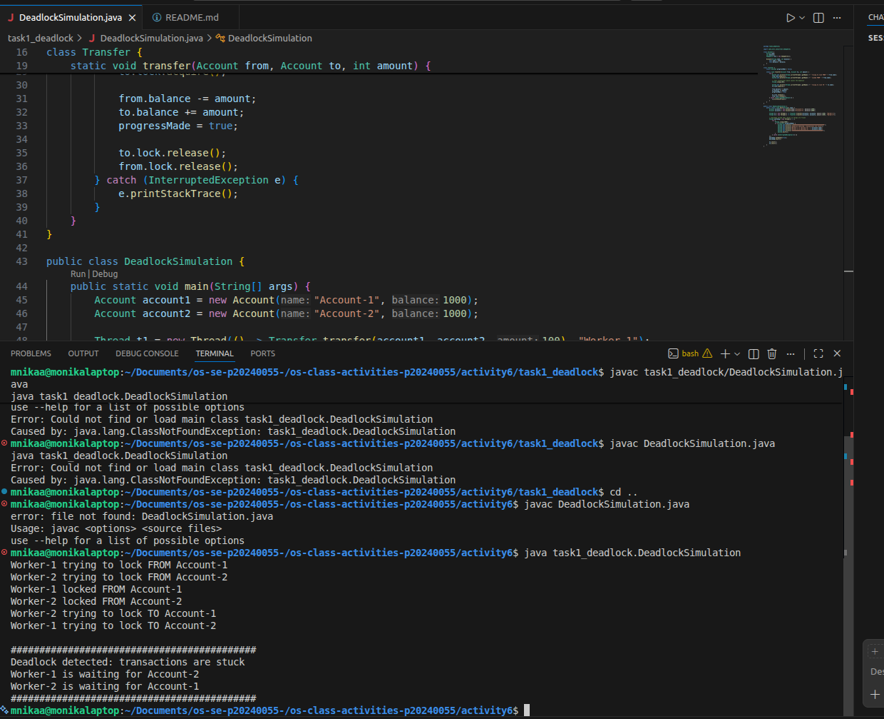
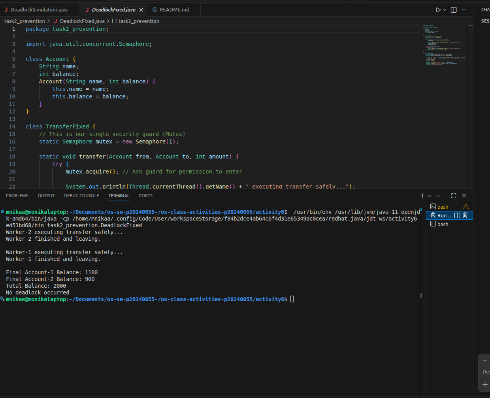

# Class Activity 6 - Deadlock Simulation

- **Student Name:** Thai Monika
- **Student ID:** p20240055
- **Programming Language Used:** Java

---

## Task 1: Deadlock Version

- **Shared resources:** The locks on Account-1 and Account-2.
- **Transaction 1:** Holds Account-1's lock, waiting for Account-2.
- **Transaction 2:** Holds Account-2's lock, waiting for Account-1.
- **Deadlock message shown:** `Deadlock detected: transactions are stuck`
- **Explanation of why the program got stuck:** Worker-1 locked Account-1 and fell asleep briefly. During that time, Worker-2 woke up and locked Account-2. When both tried to get their second lock, they found it was already held by the other worker, causing them to wait forever in a cycle.

---

## Task 2: Deadlock Prevention Version

- **Prevention strategy used:** Single global Semaphore Mutex.
- **Semaphore mutex initial value:** 1
- **Starting total:** 2000
- **Final total:** 2000
- **Did both transfers complete?** Yes.
- **Why no deadlock occurred:** The single mutex ensures only one transfer thread can happen at a time. Worker-2 cannot even start looking at accounts until Worker-1 is completely finished and has unlocked the global mutex.

---

## Questions

1. **What are the two shared resources in your bank transaction simulation?** The lock/semaphore for Account-1 and the lock/semaphore for Account-2.
2. **Which line or section of your Task 1 program creates hold-and-wait?** When `from.lock.acquire()` is called, the thread holds that lock while moving to the next line to call `to.lock.acquire()`.
3. **How does Task 1 create circular wait?** Worker-1 holds Account-1 and waits for Account-2, while Worker-2 holds Account-2 and waits for Account-1. This forms a closed waiting loop.
4. **Why does the Task 1 program need a watchdog or timeout?** Because deadlocked threads hang indefinitely and never finish on their own. A watchdog thread is needed to interrupt the freeze, report the issue, and close the program.
5. **How does the single semaphore mutex prevent deadlock in Task 2?** It forces operations to become sequential. Since only one thread can hold the mutex, a second thread cannot grab a partial resource and create a conflict.
6. **Which of the four deadlock conditions does your Task 2 solution remove or avoid?** It removes **Hold-and-Wait** (threads no longer hold a resource while waiting for another) and **Circular Wait**.
7. **Why must the final total bank balance remain unchanged after both transfers?** Because money is only being transferred internally. No money is entering or leaving the system, so the total sum must be conserved.

---

## Reflection
This activity shows how easily systems can crash when multiple paths cross while accessing individual resources without coordination. While using a single global lock is an easy way to fix a deadlock, it slows things down because threads have to wait in a single file line. In massive real-world banking apps, engineers use advanced locking order techniques so transfers can still happen at the same time safely.