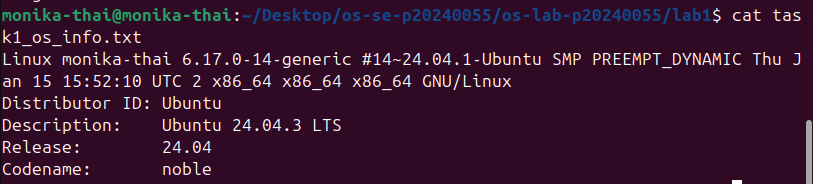

# OS Lab 1 Submission

- **Student Name:** Thai Monika
- **Student ID:** p20240055

---

## Task 1: Operating System Identification

I use VMWare to virtualize linux noble 23.04 LTS

---

## Task 2: Essential Linux File and Directory Commands

I create, read, update, and delete linux shell commands on file a and b and output them into text files.

---

## Task 3: Package Management Using APT
remove saves the configuration while purge remove all instances including the configuration of the package

<!-- Insert your screenshot for Task 3 below: -->
<!-- SCREENSHOT REQUIREMENT: Show the output of ls -ld /etc/mc after running apt-get remove (folder still exists) versus after running apt-get purge (folder is gone). -->

---

## Task 4: Programs vs Processes (Single Process)

I ran the process, in this case sleep with 120 seconds as arg, in the background using the ampersand symbol `&` and I checked the processes running on my system with ps and output them into the `task4_process_list.txt`

<!-- Insert your screenshot for Task 4 below: -->
<!-- SCREENSHOT REQUIREMENT: Show the terminal where you ran sleep 120 & and the subsequent ps output showing the sleep process running. -->

---

## Task 5: Installing Real Applications & Observing Multitasking

I ran 3 background processes simulating multitasking and read the processes with `ps` again into `task5_multitasking.txt`

<!-- Insert your screenshot for Task 5 below: -->
<!-- SCREENSHOT REQUIREMENT: Show the terminal ps output capturing the multiple background tasks (sleep and python3 server) running at the same time. -->

---

## Task 6: Virtualization and Hypervisor Detection

My system is running on a virtualization of the Linux through vmware with the hypervisor vendor from vmware as my host machine name is monika-thai

<!-- Insert your screenshot for Task 6 below: -->
<!-- SCREENSHOT REQUIREMENT: Show the terminal output of the systemd-detect-virt and lscpu commands. -->

