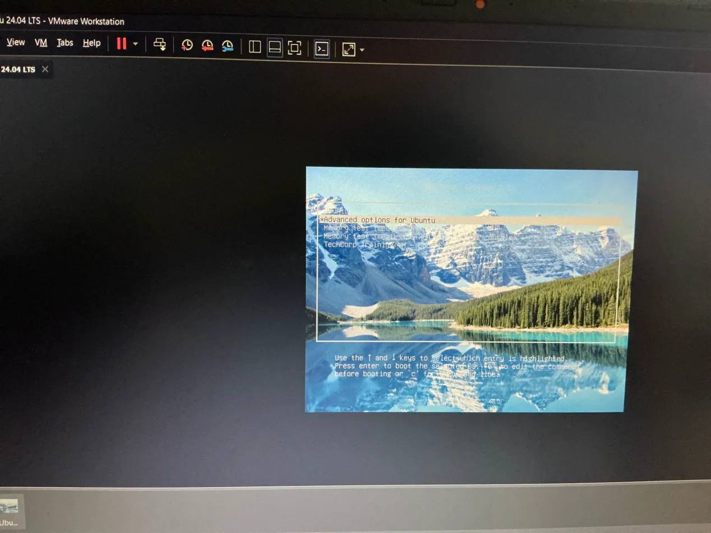
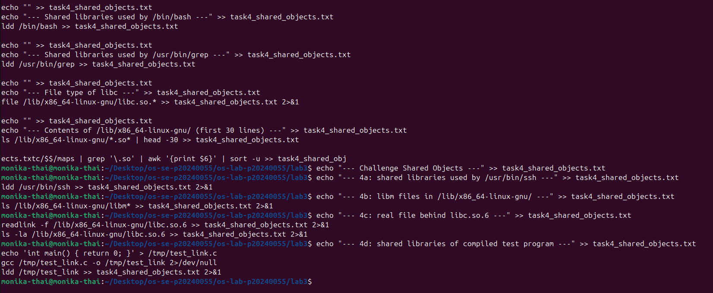
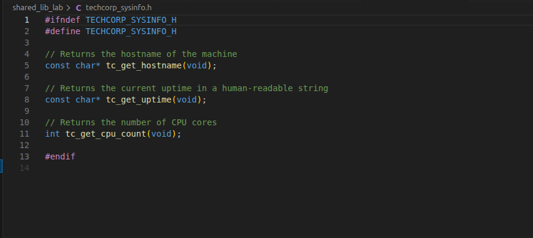
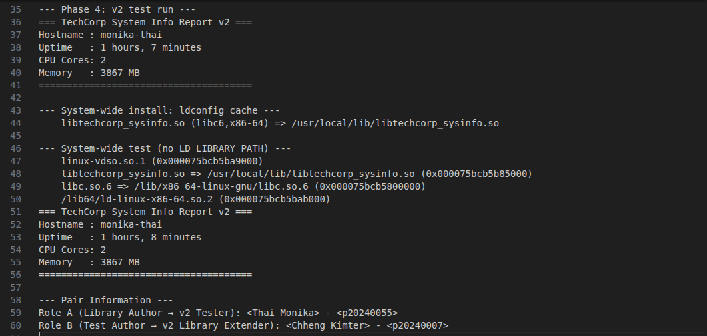
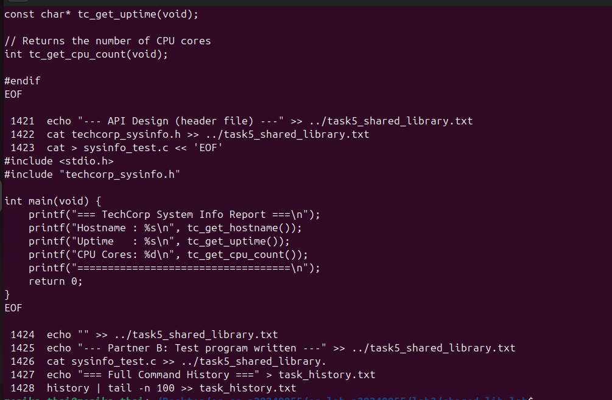

# OS Lab 3 Submission — Wildcards, Links, GRUB & Shared Libraries

- **Student Name:** Thai Monika
- **Student ID:** p20240055
- **Partner Name (Task 5):** Chheng Kimter
- **Partner ID (Task 5):** p20240007

---

## Task Output Files

During the lab, each task redirected its output into `.txt` files. These files are your primary proof of work for the **guided portions** of each task. Make sure all of the following files are present in your `lab3/` folder:

- [ ] `task1_wildcards.txt`
- [ ] `task2_links.txt`
- [ ] `task3_grub.txt`
- [ ] `task4_shared_objects.txt`
- [ ] `task5_shared_library.txt`
- [ ] `task_history.txt`

---

## Screenshots

The screenshots below document the **Challenge sections**, **VM tasks**, **pair task**, and **command history**. The guided task outputs are already captured in the `.txt` files above.

---

### Screenshot 1 — Task 1 Challenge: Wildcards

Show the terminal where you ran your wildcard challenge commands **1a–1d** (listing files with `r*`, single-character match with `?`, brace expansion for `memo_` files, and removing `.log` files). This should show both the commands you typed and their output.

<!-- Insert your screenshot below: -->


---

### Screenshot 2 — Task 2 Challenge: Links

Show the terminal where you ran your link challenge commands **2a–2c** (creating hard links to `shared_data.txt`, creating a symlink to a directory, and testing what happens when the original is deleted). Show the inode numbers and link counts.

<!-- Insert your screenshot below: -->


---

### Screenshot 3 — Task 3 Part B: VM Snapshot

Show your VM's snapshot panel confirming the "Before Boot Lab" snapshot was created before starting any VM changes.

<!-- Insert your screenshot below: -->


---

### Screenshot 4 — Task 3 Part B: GRUB Timeout Config

Show the modified `/etc/default/grub` with `GRUB_TIMEOUT=10` and the cleared `GRUB_CMDLINE_LINUX_DEFAULT`.

<!-- Insert your screenshot below: -->


---

### Screenshot 5 — Task 3 Part B: Custom GRUB Entry

Show the GRUB menu displaying your custom "TechCorp Training VM — Boot Standard" entry.

<!-- Insert your screenshot below: -->


---

### Screenshot 6 — Task 3 Part B: GRUB Background Image

Show the GRUB menu with your custom background image visible behind the menu text.

<!-- Insert your screenshot below: -->


---

### Screenshot 7 — Task 3 Part C: Recovery Mode

Show the GRUB advanced options and the recovery root shell with the output of `whoami`, `mount | grep "on / "`, and `uname -r`.

<!-- Insert your screenshot below: -->


---

### Screenshot 8 — Task 3 Part C: Broken GRUB

Show the `grub>` command line prompt that appears after the GRUB configuration was removed.

<!-- Insert your screenshot below: -->


---

### Screenshot 9 — Task 3 Part C: Manual Boot

Show the manual GRUB commands you typed (`set root`, `linux`, `initrd`, `boot`) and the system beginning to start up.

<!-- Insert your screenshot below: -->


---

### Screenshot 10 — Task 3 Part C: Restored & Normal Boot

Show the output of `ls -la /boot/grub/grub.cfg` and `head -5 /boot/grub/grub.cfg` confirming the configuration was restored, plus `uname -r` and `uptime` after normal boot.

<!-- Insert your screenshot below: -->


---

### Screenshot 11 — Task 3 Challenge: GRUB Customization

Show the GRUB menu with your custom color scheme (challenge 3b) and the `grep` output for the root partition UUID (challenge 3c).

<!-- Insert your screenshot below: -->


---

### Screenshot 12 — Task 4 Challenge: Shared Objects

Show the terminal where you ran your shared objects challenge commands **4a–4d** (inspecting `ssh`/`curl` libraries, listing `libm*` files, following the `libc.so.6` symlink chain, and compiling/inspecting a test program). Show the `ldd` and `readlink` output.

<!-- Insert your screenshot below: -->


---

### Screenshot 13 — Task 5: Pair API Design

Show **both partners' screens** with the agreed header file (`techcorp_sysinfo.h`) open, proving the API was designed collaboratively.

<!-- Insert your screenshot below: -->


---

### Screenshot 14 — Task 5: Pair Integration Test

Show the final integration test: `ldconfig -p | grep techcorp` showing registration, `ldd ./sysinfo_test_v2` showing the library is resolved, and the v2 test program output displaying hostname, uptime, CPU cores, and memory.

<!-- Insert your screenshot below: -->


---

### Screenshot 15 — Full Command History

Run the following command and take a screenshot:

```bash
history | tail -n 100
```

<!-- Insert your screenshot below: -->

