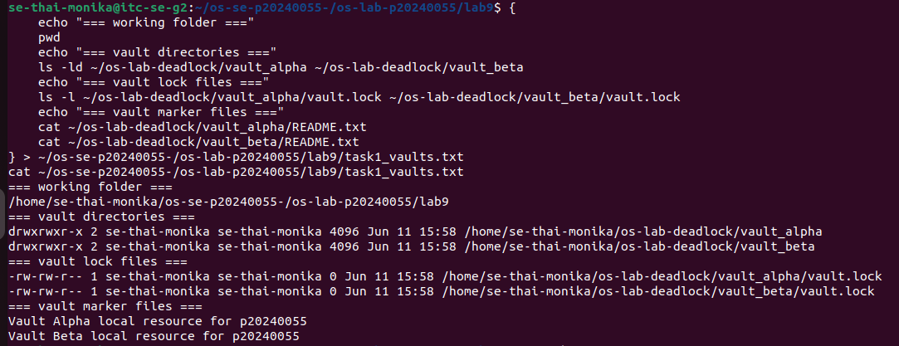
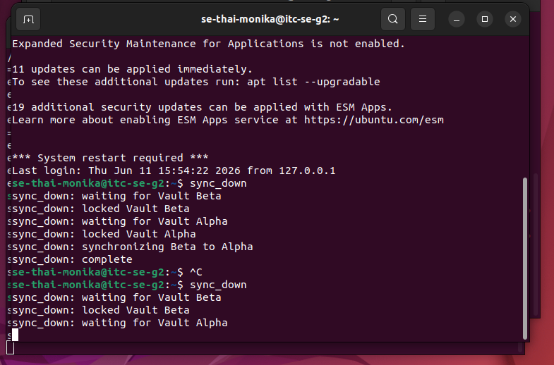
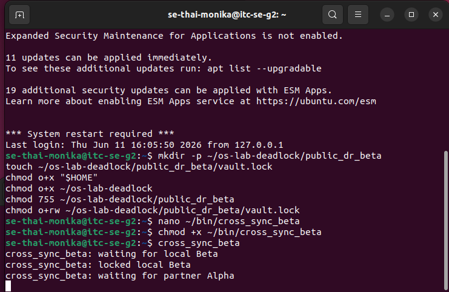
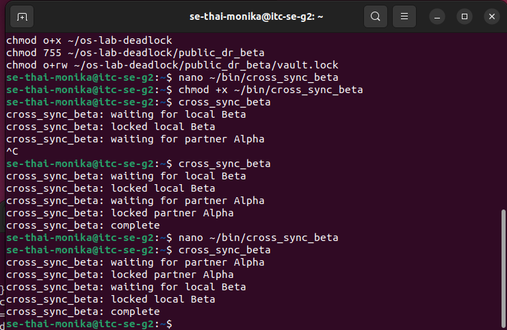
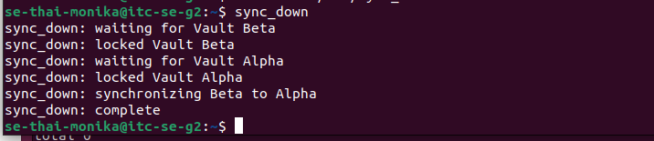
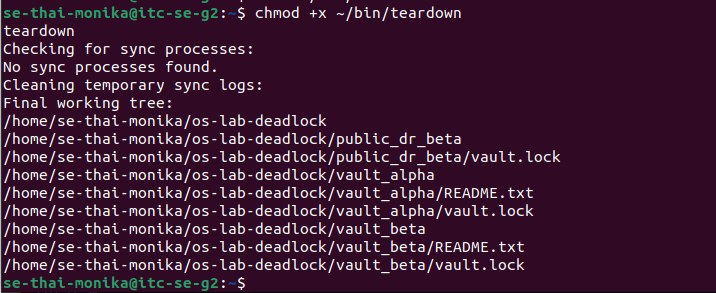

# Lab 9: Quantum Vault Deadlock

**Student ID:** p20240055  
**Role:** Player B  
**Partner username:** se-chheng-kimter  

## Answers

1. Each `vault.lock` file represents exclusive access to a vault resource — like a key that only one process can hold at a time.

2. `flock` requires every script to lock the same shared file because coordination only works if both scripts compete over the exact same file. Different files mean no coordination.

3. `sync_up` held **Vault Alpha** and waited for **Vault Beta**.

4. `sync_down` held **Vault Beta** and waited for **Vault Alpha**.

5. The four deadlock conditions in Level 3 were: mutual exclusion, hold and wait, no preemption, and circular wait.

6. The Alpha-before-Beta rule breaks circular wait because if everyone must lock Alpha first, no process can hold Beta while waiting for Alpha — the cycle cannot form.

7. `flock -w` is useful because it makes scripts fail fast instead of hanging forever, allowing the system to recover and retry even if deadlock is not fully prevented.

8. Stuck processes still hold locks and will block any future scripts from running, so checking for them ensures a clean state before finishing.

## Screenshots

